# Assignment D3-V6: Warehouse Robotics – Con-veyor Belt Dynamics
This assignment targets automated logistics scheduling by modeling interactions between mobile manipulator robots and autonomous conveyor belts within a warehouse environment.

The goal is to generate valid, optimized plans that allow robots to navigate a topology graph, pick/drop items, and place or retrieve packages from autonomous conveyor belts.

The approach follows two methodologies:

- Q1 (Classical PDDL): A discrete approximation model utilizing action costs.

- Q2 (PDDL+): A continuous-time model using numerical fluents, linear processes, and events to capture real-time conveyor physics.

## PDDL 
The logic behind the PDDL model is that the continuous nature of the conveyor is discretized through the conveyor-step action, moving a package forward by one cell at a cost of 0. This contrasts with the robot's move action, which incurs a cost of 2 to incentivize using the conveyor belt whenever computationally optimal.

Action used: 
- move $\rightarrow$ for the robot moving within the warehouse
- pick $\rightarrow$ from the storage areas
- place $\rightarrow$ on delivery areas
- retrive $\rightarrow$ on conveyor belts end segment
- load-conveyor $\rightarrow$ used by the robot to put packages at the start of the conveyor belts
- conveyor-step $\rightarrow$ action to simulate the package move on the conveyor balts

Two different scenario:
- **Optional Conveyor Use**: Robot can deliver packages either by walking along the grid or using the conveyor network. 
<p align="center">
  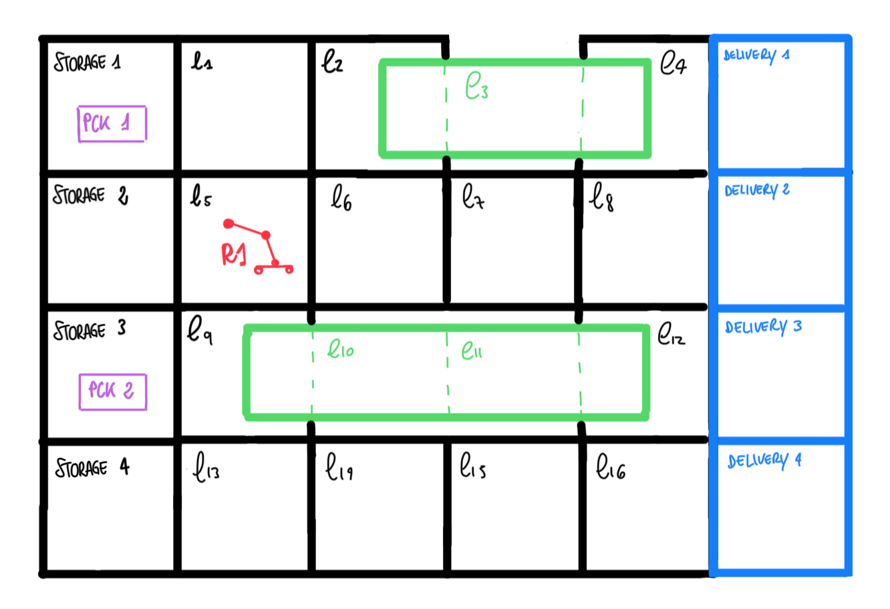
</p>

**The results** obtain are: 

The satisfiable plan obtain by the planner: 

<p align="center">
  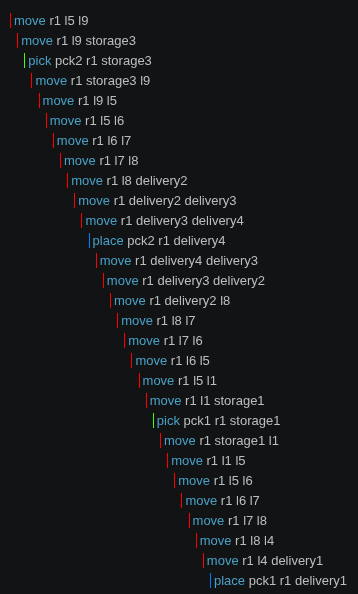
  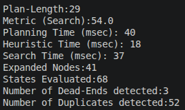
</p>

The optimal plan, found by test (because the planner does not take into consideration :metric minimize): 

<p align="center">
  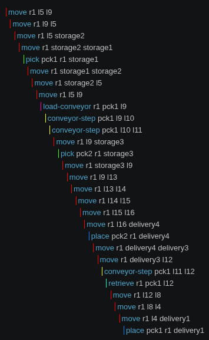
  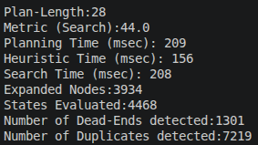
</p>

(To obtain this result dis-comment the row 153 on problem_optional.pddl file)

- **Necessary Conveyor Use**: The map topology presents disconnected components; the conveyor belt acts as the unique bridge between isolated robots

<p align="center">
  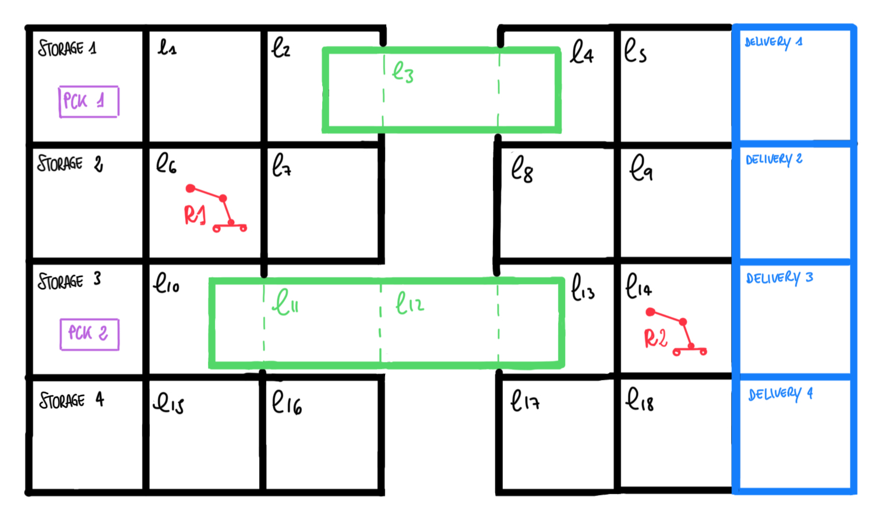
</p>

**The results** obtain are: 

The satisfiable plan obtain by the planner: 

<p align="center">
  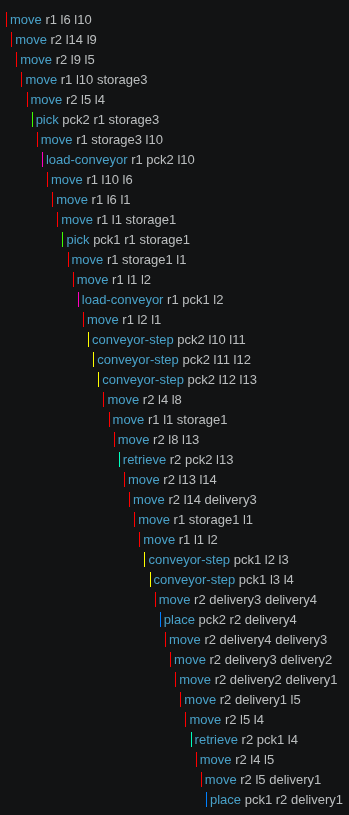
  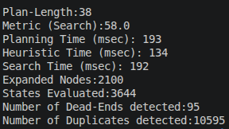
</p>

The optimal plan, found by test (because the planner does not take into consideration :metric minimize): 

<p align="center">
  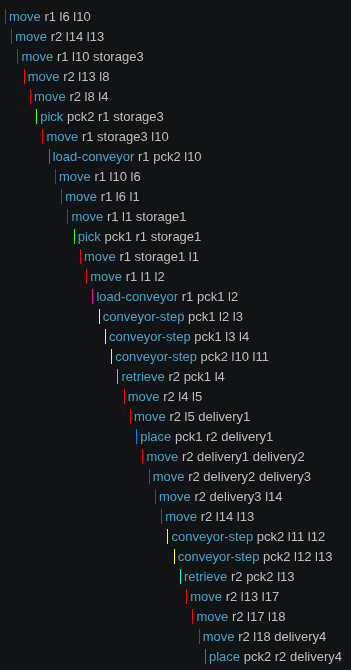
  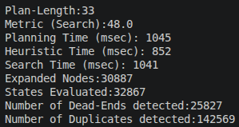
</p>

(To obtain this result dis-comment the row 159 on problem_necessary.pddl file)

**How to Run the PDDL Models**

On visual studio:
1) press on problem.pddl file
2) on the list that comes out select: "PDDL: run del planner and display the plan"
3) select the BFWS or ENHSP planner


## PDDL +
The PDDL+ domain shifts from static steps to linear functions over continuous time.

Processes used: 
- package-movement $\rightarrow$ models the continuous movement of a package along a running conveyor belt segment
- robot-timers $\rightarrow$ keeps track of the time a robot spends working on an action, increasing a timer fluent until the task is completed

Events used: 
- free-robot $\rightarrow$ triggers as soon as a robot finishes its task timer, making the robot free and ready to take on a new job
- advance-segment $\rightarrow$ triggers automatically the exact instant a package reaches a progress threshold of 1.0, instantly transferring it to the next adjacent cell of the conveyor belt and resetting its progress fluent to 0.0
- reach-exit $\rightarrow$ handles the autonomous routing when a package reaches the end of a conveyor segment and automatically transitions onto an interconnected conveyor belt


For PDDL+ is drown the same scenario but with two different initializations and final goals: 
- **Easier Scenario**: 2 packages
<p align="center">
  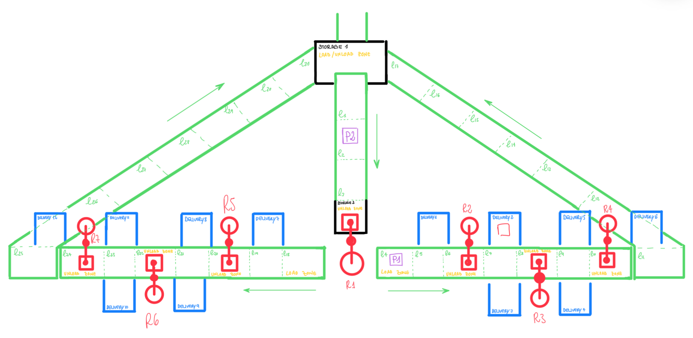
</p>


**The result** obtain is: 
<p align="center">
  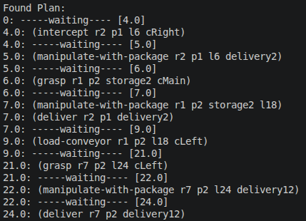
  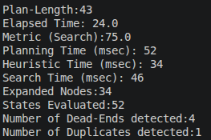
</p>

- **Harder Scenario**: 4 packages

<p align="center">
  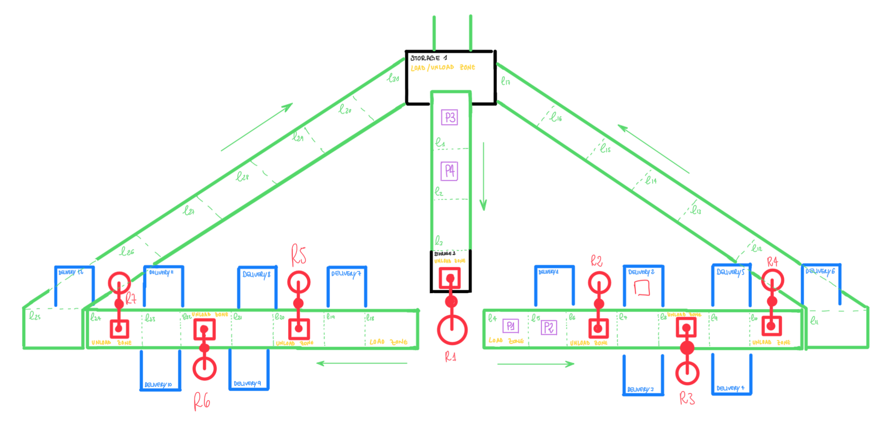
</p>

**The result** obtain is: 
<p align="center">
  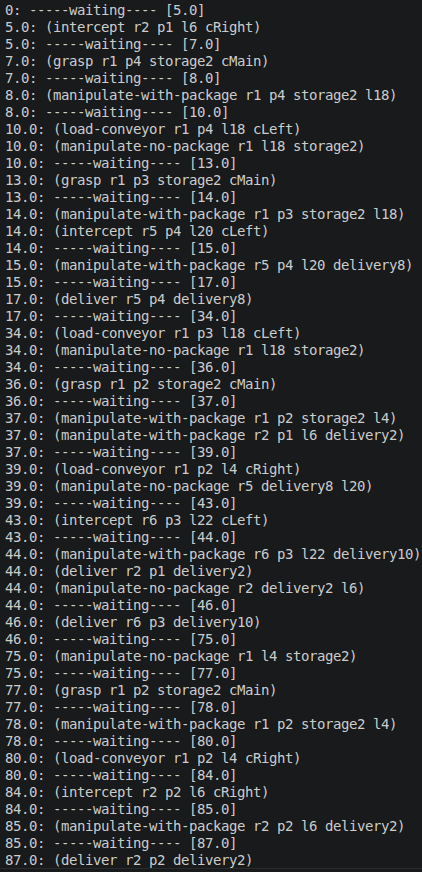
  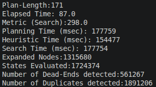
</p>

**How to Run the PDDL+ Models**

On your terminal, before runnning the planner is necessary going into enhsp folder:
```bash
cd enhsp
```
- to run the easier problem:
```bash
 java -jar enhsp.jar -o ../PDDL+/Q2_domain.pddl -f ../PDDL+/Q2_problem1.pddl
```
- to run the harder problem:
```bash
 java -jar enhsp.jar -o ../PDDL+/Q2_domain.pddl -f ../PDDL+/Q2_problem2.pddl
```
